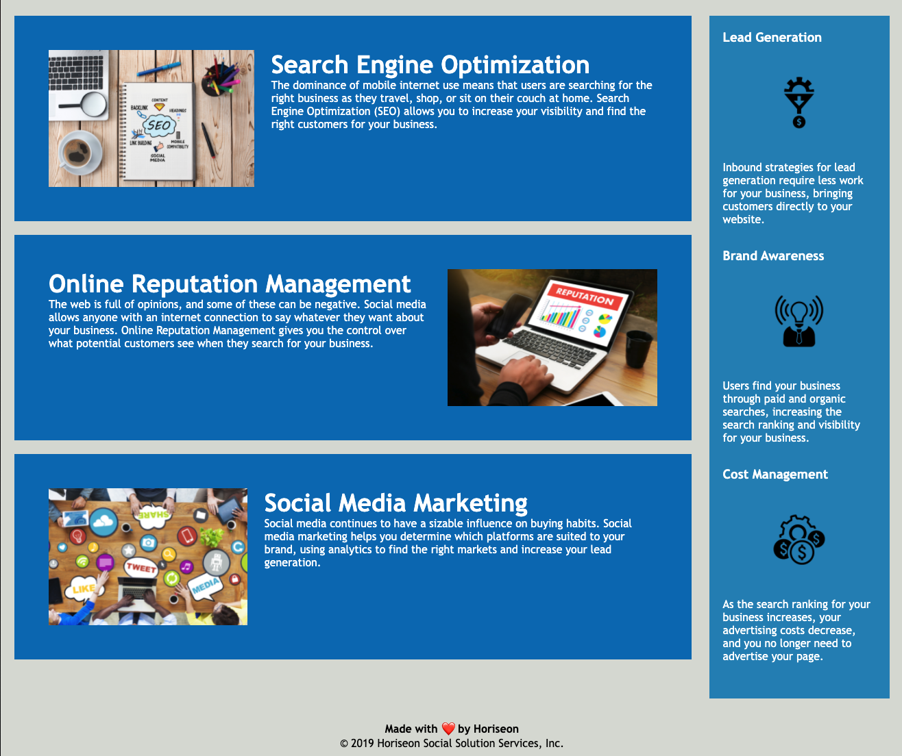

# Horiseon Code Refactor for Accessibility

## This repo contians refactored code for the [Horiseon]( https://a-wushie.github.io/horiseon-accessibility-refactor/) webpage with the goal of improving accessibility for screen-reader users as well as improving codebase quality by eliminating repition and using semantic HTML

## Here are images of the site: 

### Credits

This code was forked from [Xandromus](https://github.com/coding-boot-camp/urban-octo-telegram/commits?author=Xandromus) at https://github.com/coding-boot-camp/urban-octo-telegram

### License

Open source license: [Copying](https://choosealicense.com/licenses/gpl-3.0/)

---
© 2021 Trilogy Education Services, LLC, a 2U, Inc. brand. Confidential and Proprietary. All Rights Reserved.
